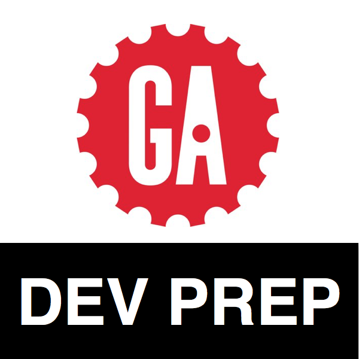

#  Dev Prep Installfest

Here are a few tools we will be using all week in the Dev Prep courses. Please try to install them before coming in. If you have any difficulties installing anything, don't worry! We can help you with any issues at the beginning of the day 🙂

#### Browser

Our preferred browser for development is Google Chrome.  
Install it [here](https://www.google.com/chrome/browser/features.html?brand=CHBD&gclid=Cj0KEQiAhs3DBRDmu-rVkuif0N8BEiQAWuUJrwRyrxo0icrOlV3smuRl-mOWJf3T-eWp_uI10uTfMo8aApao8P8HAQ&dclid=CLnt76TWtdECFVRofgodeecADA).

#### Text Editors

We will be using Sublime Text as our main text editor this week. Another useful editor is Atom.  
Install Sublime Text [here](https://www.sublimetext.com/3).  
Install Atom [here](https://atom.io/).

#### Markdown Editor

Markdown files can be edited in a regular text editor, like Sublime Text or Atom, but there is another tool called MacDown which is made specifically for markdown and displays it nicely as you write it.  
Install MacDown [here](http://macdown.uranusjr.com/).

You will probably get a warning the first time you open MacDown, since it is made by unknown developers. That's just because it's not available in the app store. Don't worry!

#### GitHub Desktop

We can interact with GitHub through the terminal, but many beginners find the GitHub Desktop application easier to use when get started.  
Install GitHub Desktop [here](https://help.github.com/desktop/guides/getting-started/installing-github-desktop/).

#### Slack

Slack is a messaging app that we will use to send you links. Please [email me](mailto:kate.wood@ga.co) so I can send you an invite to our slack team. You can use slack on the web and on a desktop app.  
Install the desktop app [here](https://slack.com/downloads/osx).